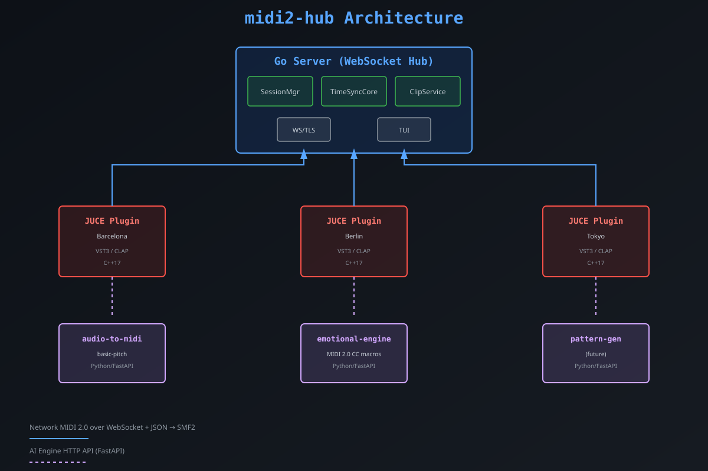

# midi2-hub

> **MIDI 2.0 AI Remix Hub** — Multi-producer sync over Network MIDI 2.0 with AI-powered remix engines.
>  
> Built for producers across cities and genres. Open source, modular, sprint-ready.

[](LICENSE)
[](https://golang.org)
[](https://isocpp.org)
[](https://midi.org)
[](#roadmap)

---

## What is this?

`midi2-hub` is a **modular hub** that connects music producers across the world using **Network MIDI 2.0** as the sync backbone, with **AI engines** (stem separation, audio-to-MIDI, pattern generation, emotional macros) running as isolated microservices.

It is designed as:

- A **Go server** (WebSocket + TUI) handling session management, clock consensus, clip routing
- A **JUCE VST3/CLAP plugin** (C++17) acting as the DAW bridge for any producer
- **Python microservices** (Podman containers) for AI: audio-to-midi, pattern generation, emotional engine
- A **Network MIDI 2.0 layer** as the universal sync and control protocol

---

## Architecture



---

## Stack

| Layer | Technology | Role |
|-------|-----------|------|
| Core MIDI 2.0 | **C++17** + ni-midi2 + libremidi | UMP parsing, MIDI-CI, I/O |
| Plugin DAW | **JUCE** (VST3/CLAP) | DAWBridge for Ableton and others |
| Hub Server | **Go 1.22** | SessionManager, routing, WebSocket |
| TUI | **Go + Bubble Tea** | Interactive CLI for debug and control |
| Transport | **WebSocket + JSON** → SMF2 | Clips, control, messages between nodes |
| AI Engines | **Python 3.12** in Podman | AudioToMidi, PatternGen, EmotionalEngine |
| Sync | **Link-style consensus** | Distributed, no single master |
| Clips | **SMF2** target (JSON in MVP) | Standard format |
| Network | **Internet** (WebSocket over TLS) | Producers in different cities |

---

## Project Structure

```
midi2-hub/
├── server/          # Go WebSocket + TUI hub
│   ├── main.go      # Entry point + HTTP server
│   ├── session/     # Room management, peer tracking
│   ├── timesync/    # Clock consensus (Link-inspired)
│   ├── transport/   # WebSocket / TLS handler
│   └── tui/         # Bubble Tea interactive CLI
├── plugin/          # JUCE VST3/CLAP (C++17)
│   ├── CMakeLists.txt
│   ├── src/PluginProcessor.cpp
│   └── ... (JUCE submodule)
├── engines/         # Python AI microservices
│   ├── audio-to-midi/
│   ├── emotional-engine/
│   └── pattern-gen/ (future)
├── docs/            # Architecture diagrams, protocol specs
└── docker-compose.yml
```

---

## Roadmap

### ✅ Sprint 1: Core Infrastructure (Week 1-2)
- [x] Go server skeleton (session + routing + TUI)
- [x] JUCE plugin skeleton (MIDI I/O stub)
- [x] Python engines scaffold (audio-to-midi, emotional)
- [x] Docker compose setup
- [x] GitHub CI (Go build/vet, Python syntax check)

### 🚧 Sprint 2: Network MIDI 2.0 (Week 3-4)
- [ ] UMP serialization (JSON → SMF2 conversion)
- [ ] WebSocket MIDI message routing
- [ ] Basic clock consensus (Link-style)
- [ ] JUCE plugin ↔ Go server WebSocket handshake

### 🔮 Sprint 3: AI Integration (Week 5-6)
- [ ] FastAPI endpoints for engines (audio-to-midi, emotional)
- [ ] HTTP → MIDI 2.0 CC mapping (emotional macros)
- [ ] Pattern generation prototype (text prompt → groove)

### 🎯 Sprint 4: MVP Polish (Week 7+)
- [ ] TLS/WSS for internet deployment
- [ ] Multi-producer session test (3+ cities)
- [ ] Performance tuning (latency < 50ms)
- [ ] Documentation + demo video

---

## Quick Start

### Prerequisites
- **Go 1.22+**
- **CMake 3.22+** + C++17 compiler
- **Python 3.11+**
- **Podman** or **Docker**

### 1. Clone + Dependencies

```bash
git clone https://github.com/Phoenixai36/midi2-hub.git
cd midi2-hub

# Add JUCE as submodule (for plugin)
git submodule add https://github.com/juce-framework/JUCE plugin/JUCE
git submodule update --init --recursive
```

### 2. Run Server + TUI

```bash
cd server
go mod download
go run .
```

The TUI will start on port `8080` (WebSocket hub).

### 3. Build Plugin (VST3/Standalone)

```bash
cd plugin
mkdir build && cd build
cmake ..
cmake --build .
```

Plugin outputs to `build/Midi2HubPlugin_artefacts/`.

### 4. Start AI Engines (Podman)

```bash
# From repo root
podman-compose up
# or: docker compose up
```

Engines available at:
- `http://localhost:8001` (audio-to-midi)
- `http://localhost:8002` (emotional-engine)

---

## Contributing

Contributions welcome! This is an **open sprint** — pick any task from the [Roadmap](#roadmap) and submit a PR.

1. Fork the repo
2. Create a feature branch (`git checkout -b feat/my-feature`)
3. Commit with [Conventional Commits](https://conventionalcommits.org) (`feat:`, `fix:`, `docs:`)
4. Push and open a PR

---

## License

MIT — see [LICENSE](LICENSE)
